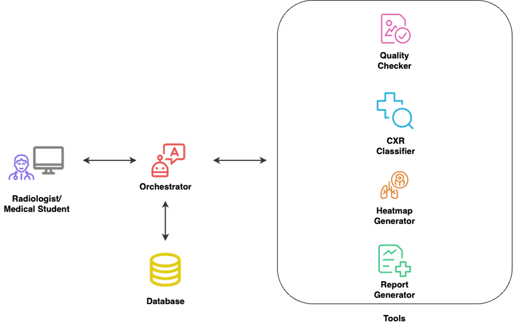
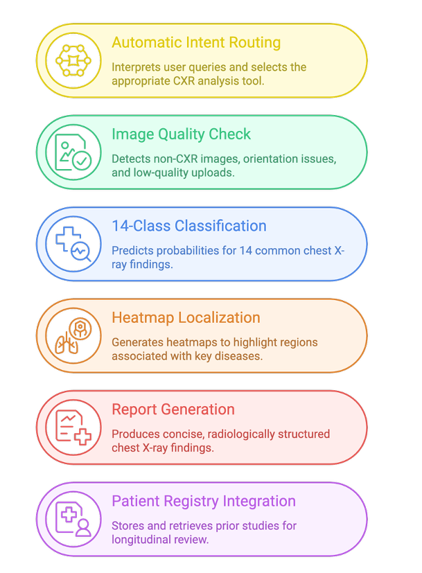

# LungLine: An Agentic Chest X‑Ray Assistant
**Authors:** Mohamad Mazeh, Ahmad Chehab El Dine, and Hadi Al Mubasher — <{mmm163, ajc14, hma154}@mail.aub.edu>

This repository contains the full implementation of **LungLine**, an agentic chest X-ray analysis system developed as part of the requirements for **EECE 798S – Agentic Systems** at the **American University of Beirut (AUB)**, instructed by **Dr. Ammar Mohanna**. The project integrates multimodal AI models, agentic tool routing, safety guardrails, and a unified Gradio interface to demonstrate end-to-end autonomous reasoning over chest radiographs.

LungLine is an **agentic chest X‑ray (CXR) assistant** that combines:

- **Image Quality Check (QC)** using CLIP‑ViT‑B/32  
- **14‑class CXR classification** on a MIMIC‑CXR subset  
- **8‑class heatmap localization** trained on ChestX‑Det  
- **LLM‑based radiology report generation** (MedGemma‑4B‑IT, fine‑tuned)  
- **Patient registry integration** via a lightweight database  
- **Tool routing and safety guardrails** using OpenAI **Omni**  

The final agent lives in the **`cxr_agent/`** folder and exposes a Gradio interface that can be run locally or on Google Colab (A100‑ready). Upstream training code for classification, localization, and report generation models lives in other folders of the repository.

---

## 1. System Overview

LungLine is designed as an **agentic system**: the user interacts with a single chat interface, and the agent decides which tools to call (QC, classifier, heatmaps, report generator, database) based on the user’s intent and the current state of the case.



### Core Capabilities



- **Automatic Intent Routing** – Uses OpenAI **Omni** to interpret user queries and route them to the appropriate CXR tools.  
- **Image Quality Check (QC)** – CLIP‑ViT‑B/32‑based gate that rejects non‑CXR or poor‑quality images and blocks unsafe analysis.  
- **14‑Class Classification** – Predicts probabilities for common chest X‑ray findings on a balanced MIMIC‑CXR subset (15,319 images).  
- **8‑Class Heatmap Localization** – Generates Gaussian heatmaps for 8 localization classes aligned between MIMIC‑CXR and ChestX‑Det.  
- **Report Generation** – Produces radiology‑style findings using a fine‑tuned **MedGemma‑4B‑IT** model.  
- **Patient Registry** – Stores and retrieves prior cases (image metadata, probabilities, report) using a SQLite database.  

---

## 2. Datasets Used

### 2.1 MIMIC‑CXR Subset (15,319 Images)

- Used to **train and evaluate** the CXR classification models.  
- Contains de‑identified chest radiographs with corresponding radiology reports.  
- Large‑scale clinical dataset enabling robust disease classification performance.

### 2.2 ChestX‑Det

- Used to **train and test** the 8‑class heatmap localization models.  
- Includes **bounding‑box annotations** for localized pathologies (e.g., fracture, pneumothorax).  
- Enables supervised training of spatial disease localization via Gaussian heatmaps.

### 2.3 MIMIC‑CXR Reports (Text Corpus)

- Used to **fine‑tune the report generation model** (MedGemma‑4B‑IT).  
- Provides high‑quality, structured radiology reports for language model adaptation.  
- Aligns the LLM output style with real clinical reporting.

### 2.4 IU Chest X‑Ray Dataset

- Used as an **external evaluation dataset** for report generation.  
- Contains paired images and expert‑written findings/impression paragraphs.  
- Ensures cross‑dataset robustness and generalization of the LLM‑generated reports.

---

## 3. Label Taxonomies and Common Classes

### 3.1 MIMIC‑CXR 14‑Class Label Set

The 14 classification labels (used by the SwinV2‑Large classifier) are:

1. Atelectasis  
2. Cardiomegaly  
3. Consolidation  
4. Edema  
5. Pleural Effusion  
6. Pneumonia  
7. Pneumothorax  
8. Fracture  
9. Lung Lesion  
10. Lung Opacity  
11. Enlarged Cardiomediastinum  
12. Pleural Other  
13. Support Devices  
14. No Finding  

### 3.2 ChestX‑Det 13‑Class Label Set

The ChestX‑Det dataset provides bounding boxes for the following 13 pathologies:

1. Atelectasis  
2. Calcification  
3. Cardiomegaly  
4. Consolidation  
5. Diffuse Nodule  
6. Effusion  
7. Emphysema  
8. Fibrosis  
9. Fracture  
10. Mass  
11. Nodule  
12. Pleural Thickening  
13. Pneumothorax  

### 3.3 Common Classes Used for Heatmaps (8‑Class Localization)

For heatmap localization, LungLine focuses on the **intersection** between MIMIC‑CXR and ChestX‑Det labels, mapped where necessary (e.g., “Effusion” → “Pleural Effusion”, “Mass/Nodule” → “Lung Lesion”, “Pleural Thickening” → “Pleural Other”).

The **8 localization classes** used by the heatmap models are:

1. Atelectasis  
2. Cardiomegaly  
3. Consolidation  
4. Pleural Effusion  
5. Fracture  
6. Pneumothorax  
7. Lung Lesion  
8. Pleural Other  

These are exactly the classes for which LungLine produces localization heatmaps.

---

## 4. CXR Classification Models

### 4.1 Summary

We trained several backbone architectures on the 14‑label MIMIC‑CXR subset and evaluated them using ROC‑AUC, PR‑AUC, F1 scores, and Expected Calibration Error (ECE). The **SwinV2‑Large** model is used in the final agent.

### 4.2 Classification Results

| Model             | Architecture Type                                   | Mean ROC‑AUC | Mean PR‑AUC | Mean F1 | Macro F1 @ 0.5 | Micro F1 @ 0.5 | ECE    |
|-------------------|-----------------------------------------------------|-------------:|------------:|--------:|----------------:|----------------:|--------|
| **SwinV2‑Large**  | Hierarchical Transformer (Shifted Window V2)       | **0.8112**   | **0.4621**  | **0.4913** | **0.4093**      | **0.5523**      | 0.0684 |
| ConvNeXt‑Base     | Modernized CNN (ConvNeXt / ResNet‑style)           | 0.8016       | 0.4540      | 0.4863 | 0.3656          | 0.5180          | **0.0387** |
| ConvNeXt‑Tiny     | Lightweight modern CNN                             | 0.8022       | 0.4436      | 0.4787 | 0.3653          | 0.5191          | 0.0391 |
| ViT‑Base          | Vanilla Vision Transformer (patch‑based)           | 0.7921       | 0.4520      | 0.4739 | 0.3933          | 0.5160          | 0.0665 |
| BEiT‑V2           | Masked Image Modeling Transformer                  | 0.7776       | 0.4191      | 0.4506 | 0.3437          | 0.4750          | 0.0464 |
| BioMedCLIP        | Medical vision‑language CLIP model                 | 0.7710       | 0.3935      | 0.4356 | 0.2887          | 0.4615          | 0.0440 |

In the deployed agent, we load the **SwinV2‑Large** classifier checkpoint as the primary diagnostic backbone.

---

## 5. Heatmap Localization Models

The localization head predicts 8 Gaussian heatmaps, each corresponding to one of the localization classes listed in Section 3.3. Training is fully supervised using ChestX‑Det bounding boxes.

### 5.1 Model Variants (M1–M7)

| ID  | Model Name                        | Backbone       | Attention                | Decoder / Localization Head                                                                | Deep Supervision | Loss Function                              |
|-----|-----------------------------------|----------------|--------------------------|--------------------------------------------------------------------------------------------|------------------|--------------------------------------------|
| M1  | SwinV2‑Loc8‑Simple               | SwinV2 Large   | None                     | Direct 8‑class conv localizer → upsample 8→256; no skips or refinement                    | None             | BCE + Dice                                 |
| M2  | SwinV2‑Loc8‑Attention            | SwinV2 Large   | SpatialAttention (8×8)   | Same simple 8→256 conv‑upsample decoder as M1                                             | None             | BCE + Dice                                 |
| M3  | SwinV2‑UNetLite                  | SwinV2 Large   | SpatialAttention (8×8)   | UNet‑Lite decoder: 8→16, fuse with 16×16 skip, then 16→256                                | DS @ 16×16       | BCE + Dice                                 |
| M4  | SwinV2‑MSA‑ProUNet               | SwinV2 Large   | SpatialAttention (8×8)   | Progressive UNet: 8→16 → fuse → 16→32 → fuse → 32→64→128→256 (multi‑scale)               | DS @ 16, 32      | BCE + Dice                                 |
| M5  | SwinV2‑MSA‑ProUNet‑Lovasz        | SwinV2 Large   | SpatialAttention         | Same decoder as M4 (progressive multi‑scale UNet)                                         | DS @ 16, 32      | Focal BCE + Soft Dice + Lovasz (weighted)  |
| M6  | SwinV2‑MiniUNet                  | SwinV2 Large   | SpatialAttention         | Minimal 2‑scale decoder: 8→16 → fuse with 16×16 → upsample 16→256                         | DS @ 16          | BCE + Dice                                 |
| M7  | SwinV2‑ProUNet‑NoLovasz          | SwinV2 Large   | SpatialAttention         | Same decoder family as M4 but without Lovasz                                              | DS @ 16, 32      | BCE + Dice                                 |

### 5.2 Localization Performance

| Model                        | Mean IoU | Mean Dice | Mean Corr | Mean Box IoU |
|------------------------------|---------:|----------:|----------:|-------------:|
| M1 — Loc8‑Simple             | 0.0027   | 0.0053    | 0.0051    | 0.0563       |
| M2 — Loc8‑Attention          | 0.0245   | 0.0447    | −0.0364   | 0.0565       |
| M3 — UNet‑Lite               | 0.1343   | 0.2366    | 0.2883    | 0.0835       |
| M4 — MSA‑ProUNet             | 0.1685   | 0.2603    | 0.3401    | 0.1118       |
| M5 — MSA‑ProUNet + Lovasz    | 0.1569   | 0.2604    | 0.3330    | 0.0940       |
| **M6 — MiniUNet**            | **0.1955** | **0.3339** | **0.4328** | **0.1122**   |
| M7 — ProUNet‑NoLovasz        | 0.1519   | 0.2785    | 0.4094    | 0.0905       |

The **M6 (SwinV2‑MiniUNet)** model provides the best compromise between accuracy and architectural simplicity and is used as the **default heatmap generator** in the agent.

---

## 6. Report Generation Models

### 6.1 Evaluation Metrics

LungLine evaluates report generation using:

- **Semantic Similarity** – Cosine similarity between ClinicalBERT embeddings of generated vs reference reports.  
- **Clinical Efficacy — Accuracy** – BioClinicalBERT classifier run on both reports to derive 14‑label vectors; accuracy measures alignment in clinical labels.  
- **Clinical Completeness** – Fraction of ground‑truth positive labels that appear in the model’s predicted labels (sensitivity to important abnormalities).  
- **LLM‑as‑Judge — Factual Alignment (0–5)** – Omni scores factual consistency and contradictions vs the reference report.  
- **LLM‑as‑Judge — Clinical Coverage (0–5)** – Omni scores whether major findings visible on CXR are mentioned.  
- **LLM‑as‑Judge — Style & Organization (0–5)** – Omni scores clarity, structure, and professional reporting style.  
- **LLM‑as‑Judge — Overall Score (0–10)** – Aggregated score summarizing correctness, coverage, and clarity.

### 6.2 Report Generation Results

| Model                      | Semantic Similarity (%) | ClinicalEff Accuracy (%) | Clinical Completeness (%) | Factual Alignment (/5) | Clinical Coverage (/5) | Style & Organization (/5) | Overall Score (/10) |
|----------------------------|------------------------:|-------------------------:|--------------------------:|-----------------------:|-----------------------:|--------------------------:|--------------------:|
| LLaVA‑v2                   | 91.72                  | 93.44                   | 99.19                    | 2.16                   | 2.29                   | 2.95                     | 5.48                |
| MedGemma‑4B‑IT             | 94.91                  | 96.12                   | 99.19                    | 3.36                   | 3.22                   | 3.95                     | 7.26                |
| **MedGemma‑4B‑IT (Tuned)** | **95.85**              | **96.32**               | **99.25**                | **3.62**               | **3.53**               | **3.97**                 | **7.70**            |
| CheXagent‑2‑3B             | 87.51                  | 42.64                   | 98.83                    | 1.91                   | 1.97                   | 2.88                     | 4.96                |
| CheXagent‑8B               | 88.15                  | 56.08                   | 98.81                    | 1.67                   | 1.59                   | 2.00                     | 4.15                |
| MAIRA‑2                    | 95.05                  | 89.12                   | 97.99                    | 3.59                   | 3.55                   | 3.80                     | 7.64                |

The deployed agent uses **MedGemma‑4B‑IT (fine‑tuned)** as the primary report generator.

---

## 7. Safety, QC, and Guardrails

LungLine is a **research prototype**, not a clinical product. Safety is enforced at three levels: **heatmap behavior**, **QC gating**, and **OpenAI‑based guardrails**.

### 7.1 Heatmap Generation Behavior

- Heatmaps are available **only for the 8 localization classes** in Section 3.3.   
- Heatmaps are generated **only for findings with predicted probability ≥ 0.5**, reducing noisy or misleading overlays.

### 7.2 QC‑Driven Restrictions (CLIP‑ViT‑B/32)

- LungLine uses a **CLIP‑ViT‑B/32‑based QC model** (see `modules/qc.py`) to check if the uploaded image is a **valid CXR**.  
- The QC gate detects:
  - non‑CXR images (natural images, screenshots, random content),  
  - other modalities (CT, MRI, ultrasound, etc.),  
  - severely corrupted or unreadable images.  
- If QC severity is **“fail”**, the agent **blocks all clinical tools**, including classification, heatmaps, report generation, and student explanations.  
- Interpretation is allowed only when QC **passes** or **warns**, enforcing a strict image‑quality gate.

### 7.3 OpenAI‑Based Guardrails (Omni)

- Every user message is screened by **OpenAI Omni** moderation + lightweight rule‑based filters **before** tool routing.  
- Guardrails protect against:
  - prompt injection and system‑override attempts,  
  - off‑domain / misuse of medical capabilities,  
  - unsafe, inappropriate, or non‑research requests,  
  - attempts to extract sensitive information.  
- Unsafe prompts are blocked **before** they reach the agentic router or any clinical tool.  
- When a prompt violates safety rules, the agent returns a **safe fallback message** instead of executing tools or generating clinical content.  

---

## 8. Repository Structure (High‑Level)

The LungLine repository is organized as:

```text
LungLine/
├── CXR Classification Models Training/                 # Training & evaluation scripts for 14-class classifiers
├── Heatmap Generation Models Training and Evaluation/  # Training + metrics for localization models M1–M7
├── Report Generation Models Finetuning and Inference/  # Scripts for MedGemma, LLaVA, MAIRA, CheXagent, etc.
├── Datasets Downloading/                              # Utilities for downloading & organizing datasets
├── Evaluation CSVs and Spreadsheets/                  # Aggregated metric tables (AUCs, IoUs, LLM-judge scores)
├── cxr_agent/                                         # Final agentic system and Gradio UI
└── Demo.mp4                                           # Demonstration video of the agent
```

Inside **`cxr_agent/`** (this folder is what you run):

```text
cxr_agent/
├── config.py               # Global configuration (paths, device, model ckpts, DB URL, heatmap viz parameters)
├── main.py                 # Entry point: wires together UI + orchestrator and launches Gradio
├── orchestrator.py         # High-level routing: chat_handler, registry, tool selection logic
├── ui.py                   # Gradio layout & callbacks (uses chat_handler under the hood)
└── modules/
    ├── __init__.py
    ├── agent_tools.py      # Formal tool interfaces; wraps classifier, heatmaps, report, DB, etc.
    ├── classifier.py       # SwinV2-Large 14-class classifier loading + inference utilities
    ├── db.py               # Patient registry operations (insert/retrieve by patient ID)
    ├── guardrails.py       # Omni-based moderation + rule-based guards
    ├── heatmaps.py         # M6 MiniUNet heatmap model loading + Grad-CAM / Gaussian map handling
    ├── qc.py               # CLIP-ViT-B/32 QC: load CXR, compute embeddings, severity scoring
    └── report.py           # MedGemma-4B-IT (tuned) report generation + formatting
```

At a high level:

- `ui.py` defines the Gradio interface (image upload, chat, history dropdown, heatmap gallery).  
- `orchestrator.py` implements `chat_handler`, `insert_to_registry`, `retrieve_from_registry`, and history selection, and decides which tools to call.  
- `modules/agent_tools.py` exposes a stable API for tools so `chat_handler` can call them uniformly.  
- `main.py` imports the UI wiring and starts the app.

---

## 9. Configuration (`cxr_agent/config.py`)

`config.py` centralizes all global constants. It is designed to be **Colab‑friendly** (Google Drive paths) but can be adapted easily.

### 9.1 Device and Paths

```python
DEVICE = "cuda" if torch.cuda.is_available() else "cpu"

BASE_DRIVE_DIR = Path("/content/drive/MyDrive/Colab Notebooks/Agentic Systems Term Project")

TEMP_DIR = BASE_DRIVE_DIR / "temp"
DISPLAY_DIR = TEMP_DIR / "display"
```

- `DEVICE` selects GPU if available.  
- `BASE_DRIVE_DIR` is the root for models, outputs, and the patient registry.  
- `TEMP_DIR` and `DISPLAY_DIR` store intermediate PNGs for visualization.

### 9.2 Model Paths

```python
CLASSIFIER_WEIGHTS = str(BASE_DRIVE_DIR / "models" / "swinv2_large_14class_weightedbce.pth")
MEDGEMMA_BASE_ID = "google/medgemma-4b-it"
MEDGEMMA_PEFT_DIR = str(BASE_DRIVE_DIR / "models" / "medgemma")
HEATMAP_MODEL_CKPT = str(BASE_DRIVE_DIR / "models" / "swinv2_multiscale_deep_dice_best.pth")
```

- `CLASSIFIER_WEIGHTS` → SwinV2‑Large 14‑class classifier.  
- `MEDGEMMA_BASE_ID` / `MEDGEMMA_PEFT_DIR` → base MedGemma‑4B‑IT and PEFT adapters for the tuned report generator.  
- `HEATMAP_MODEL_CKPT` → M6‑style heatmap model checkpoint.

### 9.3 Database Configuration

```python
DEFAULT_DB_URL = f"sqlite:///{BASE_DRIVE_DIR / 'cxr_patient_registry.db'}"
DATABASE_URL = os.environ.get("PATIENT_DB_URL", DEFAULT_DB_URL)
```

- Uses SQLite (`cxr_patient_registry.db`) by default.  
- Can be overridden via the `PATIENT_DB_URL` environment variable.

### 9.4 OpenAI and HF Configuration

```python
OPENAI_MODEL_NAME = os.environ.get("CXR_AGENT_OPENAI_MODEL", "gpt-4o-mini")
OPENAI_API_KEY_ENV = "OPENAI_API_KEY"
HUGGING_FACE_API_KEY_ENV = "HF_TOKEN"
```

- `OPENAI_MODEL_NAME` controls which OpenAI model is used for routing and LLM‑judge. In practice, we use **Omni** for guardrails and evaluation.  
- API keys are **never hard‑coded**; they are read from environment variables.

### 9.5 Heatmap Visualization

```python
DEFAULT_HEATMAP_ALPHA = 0.45
DEFAULT_HEATMAP_GAMMA = 10.0
```

- `DEFAULT_HEATMAP_ALPHA` – transparency for overlaying heatmaps.  
- `DEFAULT_HEATMAP_GAMMA` – exponent used to sharpen predicted maps before visualization.

---

## 10. How to Run the CXR‑Agent

### 10.1 Install Dependencies

Create and activate a Python environment (3.10+ recommended), then:

```bash
pip install -r requirements.txt
```

`requirements.txt` includes:

- `transformers>=4.50.0`  
- `accelerate`  
- `peft`  
- `timm`  
- `gradio`  
- `pydicom`  
- `pillow`  
- `openai`  
- `sqlalchemy`  

### 10.2 Configure Model Weights and Paths

1. **Download the checkpoints** and place them under `BASE_DRIVE_DIR / models` (or update paths in `config.py`):

   - SwinV2‑Large classifier → `CLASSIFIER_WEIGHTS`  
   - M6 heatmap model → `HEATMAP_MODEL_CKPT`  
   - MedGemma PEFT adapters → `MEDGEMMA_PEFT_DIR`  

2. Adapt `BASE_DRIVE_DIR` in `config.py` if you are not using Google Drive / Colab.

### 10.3 Set Environment Variables

```bash
export OPENAI_API_KEY="YOUR_OPENAI_KEY"
# Optional overrides:
export CXR_AGENT_OPENAI_MODEL="gpt-5-mini"          # or gpt-4o-mini if preferred
export PATIENT_DB_URL="sqlite:///path/to/cxr_patient_registry.db"
export HF_TOKEN="YOUR_HF_TOKEN_IF_NEEDED"
```

### 10.4 Launch the Gradio Interface

From the `cxr_agent/` directory:

```bash
cd cxr_agent
python main.py
```

This will:

- Load the QC (CLIP‑ViT‑B/32), classifier, heatmap, and report‑generation models.  
- Start a Gradio app with image upload, chat, heatmap gallery, and history selection.  
- Print a local URL in the terminal which you can open in your browser.

### 10.5 Typical Workflow

1. **Upload a CXR image.**  
   - QC runs automatically and returns **PASS**, **WARN**, or **FAIL**.  
   - If QC = FAIL, the agent refuses to perform clinical interpretation.  

2. **Interact via chat**, for example:
   - “What are the main findings on this X‑ray?”  
   - “Generate a detailed radiology report.”  
   - “Show me heatmaps for the predicted abnormalities.”  
   - “Save this patient in the registry and give me their ID.”  
   - “Does this patient have prior studies in the database?”  

3. The agent (via `chat_handler` in `orchestrator.py`):
   - Uses Omni to interpret the user request and select tools.  
   - Calls the appropriate tool from `modules/agent_tools.py`.  
   - Applies guardrails and QC restrictions.  
   - Returns a formatted answer, optionally with heatmaps and database metadata.

If you request **heatmaps before classification**, the system will:

1. Filter labels with probability ≥ 0.5.  
2. Generate and overlays heatmaps only for those labels.

---

## 11. Checkpoint Download Links

The main checkpoints used in LungLine are:

- **MedGemma‑4B‑IT (tuned for reports)**  
  https://drive.google.com/drive/folders/1PlZNgpXJrujS0PiuhHsKn27TqLqiDGJi?usp=sharing  

- **SwinV2‑Large 14‑class classifier (`CLASSIFIER_WEIGHTS`)**  
  https://drive.google.com/file/d/1unDoEp1_9HsmpNHp2nIXML205zFQP8as/view?usp=sharing  

- **Heatmap localization model (`HEATMAP_MODEL_CKPT`)**  
  https://drive.google.com/file/d/1eeF5AI_TT7aBIJMjL14vlCHWVBwS2qz_/view?usp=sharing  

Update `config.py` after downloading these files.

---

## 12. Limitations and Disclaimer

- LungLine is a **research system** and **not** an approved medical device.  
- All outputs (classification, heatmaps, reports, and explanations) are intended **for research and educational purposes only**.  
- Clinical decisions must **always** be made by qualified healthcare professionals using the full clinical context.

If you use LungLine in academic work, please cite this repository and acknowledge the source datasets (MIMIC‑CXR, ChestX‑Det, IU, etc.).

